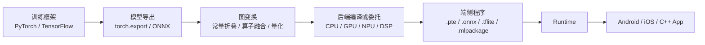
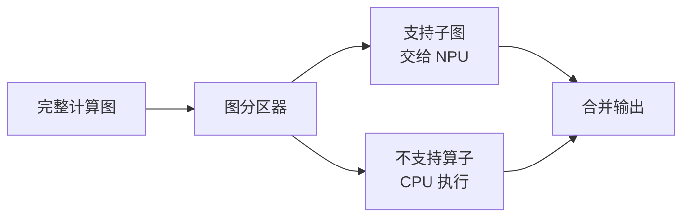
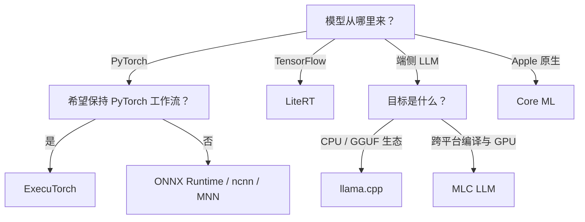

在数据中心部署模型时，我们通常先问：**一张 GPU 能跑多少请求？**

到了手机、汽车、摄像头和嵌入式设备上，问题会变成：模型能不能装进内存？第一次启动要多久？连续运行十分钟后会不会因为发热降频？某个算子没有被 NPU 支持时，系统会报错，还是悄悄回退到 CPU？

这些问题共同构成了**端侧推理（On-device Inference）**。它不是把服务端程序交叉编译一下，而是围绕有限资源、异构硬件和碎片化平台重新设计一条推理链路。

读完本文，你将建立一套端侧推理的完整坐标系：模型怎样变成设备可以执行的程序，CPU/GPU/NPU/DSP 分别负责什么，运行时和硬件后端是什么关系，以及怎样用可复现的实验判断一次优化是否真的有效。

<!-- more -->

## 📑 目录

- [1. 什么是端侧推理](#1-什么是端侧推理)
- [2. 端侧设备的四类约束](#2-端侧设备的四类约束)
- [3. 从模型到 App 的完整链路](#3-从模型到-app-的完整链路)
- [4. CPU、GPU、NPU 与 DSP](#4-cpugpunpu-与-dsp)
- [5. 端侧运行时如何选](#5-端侧运行时如何选)
- [6. 端侧优化的四个核心抓手](#6-端侧优化的四个核心抓手)
- [7. 怎样做可信的端侧 Benchmark](#7-怎样做可信的端侧-benchmark)
- [8. ExecuTorch 与 XNNPACK 最小实例](#8-executorch-与-xnnpack-最小实例)
- [9. 常见问题与排查顺序](#9-常见问题与排查顺序)
- [10. 选型建议](#10-选型建议)
- [总结](#-总结)
- [自我检验清单](#-自我检验清单)
- [参考资料](#-参考资料)

---

## 1. 什么是端侧推理

端侧推理是指模型在用户直接持有或靠近数据源的设备上执行，例如手机、平板、PC、汽车、机器人、摄像头、可穿戴设备和 IoT 终端。

它和边缘推理经常被混用，但两者的范围并不完全相同：

- **端侧（Device）**强调最终设备，资源约束通常最强；
- **边缘侧（Edge）**还可能包括基站、门店服务器和边缘网关；
- **云端（Cloud）**通常拥有更充足的算力、显存和散热条件。

为什么要把模型放到端上？常见原因有四个：

1. **低延迟**：摄像头检测、语音唤醒和驾驶辅助不能等待网络往返；
2. **离线可用**：在弱网或断网环境中仍然工作；
3. **隐私**：原始图片、语音和文本可以留在本地；
4. **成本**：高频、轻量请求在本地完成，可以减少云端计算和带宽开销。

代价是工程约束从“主要考虑吞吐和成本”，扩展为“同时考虑延迟、内存、包体积、功耗、温度、精度和兼容性”。

---

## 2. 端侧设备的四类约束

### 2.1 内存与存储

端侧模型需要同时占用模型文件、权重、激活、临时工作区和运行时本身的内存。操作系统还会限制单个 App 的可用内存，因此“物理内存有 8 GB”并不代表模型可以使用全部 8 GB。

仅权重占用可以用下面的公式做第一步估算：

$$
M_{weights} \approx P \times \frac{b}{8}
$$

其中 $P$ 是参数量，$b$ 是每个参数的位数。一个 3B 模型仅权重大约需要：

| 精度 | 理论权重大小 |
|---|---:|
| FP16/BF16 | 6 GB |
| INT8 | 3 GB |
| INT4 | 1.5 GB |

这只是理论下界，实际还要加上量化尺度、文件对齐、KV Cache、激活和工作区。

对 Decoder-only LLM，KV Cache 可以近似为：

$$
M_{KV} \approx 2 \times L \times B \times T \times H_{kv} \times D \times s
$$

其中 $L$ 为层数，$B$ 为 Batch Size，$T$ 为缓存的 Token 数，$H_{kv}$ 为 KV Head 数，$D$ 为每个 Head 的维度，$s$ 为每个元素的字节数。前面的 2 分别代表 Key 和 Value。

这解释了一个常见现象：模型权重能够加载，并不代表它可以稳定支持很长的上下文。

### 2.2 功耗与散热

端侧设备不能只看一次推理的峰值速度。CPU 或 GPU 在短时间内可能很快，但持续运行后会因为温度和功耗限制降低频率。一个可靠的实时应用应该关注稳态性能，而不是只记录刚启动时最好的一次结果。

### 2.3 硬件碎片化

两台同为 Android 的手机可能具有不同的 CPU 指令集、GPU 驱动和 NPU 工具链。同一个计算图在设备 A 上可以完整委托给 NPU，在设备 B 上却可能有若干算子回退到 CPU。

### 2.4 应用生命周期

端侧推理和 App 生命周期绑定。模型加载会不会阻塞 UI？切到后台时是否释放内存？模型更新失败后能否回滚？这些问题不属于模型结构本身，却决定了功能能否真正上线。

---

## 3. 从模型到 App 的完整链路

端侧推理通常经过下面几个阶段：



这里有三个很容易混淆的概念：

- **模型格式或中间表示（IR）**描述计算图和权重，例如 ONNX；
- **Runtime**负责加载模型、管理内存并发起执行，例如 ExecuTorch、ONNX Runtime 或 ncnn；
- **Backend/Delegate**负责真正执行一部分计算，例如 XNNPACK、Core ML、Vulkan 或 Qualcomm QNN。

Runtime 不一定亲自计算每个算子。它可以把支持的子图交给硬件后端，把剩余算子留给默认 CPU Kernel。这种机制叫作**图分区（Partitioning）**或**委托（Delegation）**。



因此，“启用了 NPU”不等于“整个模型都运行在 NPU 上”。端侧优化首先要确认实际分区结果。

---

## 4. CPU、GPU、NPU 与 DSP

### 4.1 CPU：最可靠的基线

CPU 的算子覆盖和调试体验通常最好，也是设备兼容性最强的兜底路径。优化重点包括：

- ARM NEON、SVE 等 SIMD 指令；
- 线程数和大小核调度；
- Cache 命中率与内存布局；
- XNNPACK、oneDNN 等优化 Kernel；
- 避免线程过多造成抢占和功耗上升。

### 4.2 GPU：并行度高，但搬运有成本

移动 GPU 适合并行度较高、计算规模较大的任务。常见接口包括 Vulkan、Metal 和 OpenCL。需要注意：

- 小算子可能无法摊薄调度开销；
- CPU 与 GPU 之间的数据转换和同步会消耗时间；
- 驱动质量和支持的精度在不同设备上存在差异；
- GPU 加速不保证比高度优化的 ARM CPU 更快。

### 4.3 NPU：能效高，但算子边界严格

NPU 针对矩阵计算、卷积和低精度推理进行优化，常常具有较高能效。它的主要约束是算子覆盖、Tensor Layout、动态形状和量化规则。只要计算图中出现不支持的节点，就可能发生图切分和后端切换。

### 4.4 DSP：适合持续运行的信号任务

DSP 常用于音频、传感器和低功耗常驻任务。它的算力未必最高，但能够在较低功耗下持续处理规则的数据流。

端侧硬件选型没有“永远最快”的答案。正确方法是先用 CPU 建立准确性基线，再分别测量 GPU/NPU/DSP 的覆盖率、端到端延迟和稳态功耗。

---

## 5. 端侧运行时如何选

| 运行时 | 主要入口 | 常见目标 | 适合场景 |
|---|---|---|---|
| ExecuTorch | PyTorch / `torch.export` | XNNPACK、Vulkan、Core ML、QNN 等 | 希望保持 PyTorch 工作流，或需要多硬件后端 |
| ONNX Runtime Mobile | ONNX | Android、iOS、多种 Execution Provider | 模型来源多、重视跨框架互操作 |
| LiteRT | TFLite/LiteRT | Android、iOS、GPU/NPU Delegate | TensorFlow/Google AI Edge 生态 |
| Core ML | Core ML Model | Apple CPU、GPU、Neural Engine | iOS/macOS 原生应用 |
| ncnn | pnnx / ONNX 转换 | ARM CPU、Vulkan | 轻依赖 C++、移动视觉与嵌入式部署 |
| MNN | ONNX/TFLite 等转换 | CPU、GPU、端侧 LLM | 国内移动端、传统模型和 LLM 综合部署 |
| llama.cpp | GGUF | CPU、Metal、Vulkan 等 | 本地和端侧 LLM 推理 |
| MLC LLM | 编译生成目标模型库 | Android、iOS、WebGPU、Vulkan 等 | 跨平台、编译器驱动的 LLM 部署 |

这张表用于定位，不是性能排行榜。运行时的实际表现取决于模型结构、设备、精度、后端覆盖率和版本。选型时应先固定模型与测试协议，再在目标设备上实测。

---

## 6. 端侧优化的四个核心抓手

### 6.1 模型压缩

常见方法包括结构化剪枝、蒸馏、低秩分解和选择更小的模型架构。模型压缩不仅减少计算量，也可能改变算子结构，因此需要结合目标硬件的 Kernel 支持评估。

### 6.2 量化

量化将权重或激活从 FP32/FP16 转换为 INT8、INT4 等低精度表示。需要掌握以下区别：

- **PTQ（训练后量化）**：成本低，适合快速部署；
- **QAT（量化感知训练）**：训练时模拟量化误差，通常能获得更好的精度；
- **Weight-only**：只量化权重，常用于 LLM；
- **权重与激活量化**：压缩更充分，但更依赖硬件支持；
- **Per-tensor / Per-channel**：分别使用整张 Tensor 或每个通道的量化参数。

量化不等于必然加速。如果硬件没有对应低精度 Kernel，或计算图频繁执行量化与反量化，延迟可能不降反升。评估量化必须同时报告模型大小、延迟、内存和精度变化。

### 6.3 图与算子优化

图优化常见操作包括：

- 常量折叠；
- Conv-BN、Linear-Activation 等算子融合；
- 删除冗余的 Cast、Transpose 和 Reshape；
- NCHW/NHWC Layout 转换；
- 静态形状特化；
- 自定义算子或替换不受支持的算子。

重点不是让图的节点越少越好，而是减少内存访问、调度开销和后端切换。

### 6.4 内存规划

端侧内存优化包括：

- 复用生命周期不重叠的激活 Buffer；
- 使用内存映射按需加载大模型权重；
- 控制 LLM 上下文长度和 KV Cache 精度；
- 避免在预处理、Runtime 和 UI 层重复复制 Tensor；
- 采用分片加载并设置明确的内存失败降级策略。

---

## 7. 怎样做可信的端侧 Benchmark

只报告一次“平均耗时”几乎没有意义。一份能够复现的端侧 Benchmark 至少要记录：

### 7.1 环境信息

- 设备型号、SoC、内存和系统版本；
- Runtime、模型和驱动版本；
- 模型精度与量化方法；
- 实际执行后端和图分区结果；
- 线程数、输入尺寸、Batch Size 和动态形状范围。

### 7.2 性能指标

- 冷启动时间与模型加载时间；
- 预热后的 P50、P90、P99 延迟；
- 吞吐量；
- 峰值内存与稳定运行内存；
- 模型文件和 Runtime 包体积；
- 功耗、温度和持续运行后的性能变化；
- 任务精度以及与原始模型的误差。

对于 LLM，还应增加：

- **TTFT**：首 Token 延迟；
- **TPOT**：相邻输出 Token 的平均时间；
- Prefill 和 Decode 各自的 tokens/s；
- 最大稳定上下文长度；
- 峰值内存和是否触发系统内存回收。

### 7.3 推荐实验协议

1. 固定输入样本和随机种子；
2. 先跑原始框架结果，保存精度基线；
3. 模型加载和推理分开计时；
4. 预热若干次，再采集至少数十次推理；
5. 同时报告中位数与尾延迟；
6. 连续运行一段时间，观察温度和降频；
7. 检查每个子图实际使用的后端；
8. 保存脚本、配置和原始结果，不只保存最终结论。

📌 **关键点**：端侧 Benchmark 的比较对象必须控制变量。不同输入尺寸、线程数、量化精度或后端覆盖率得出的数字不能直接横向比较。

建议把每次实验的关键条件和结果一起保存，最少包含下面这些字段：

```yaml
device: "设备型号 / SoC / 内存"
os: "系统与版本"
model: "模型名、版本与文件哈希"
runtime: "运行时、版本与执行后端"
precision: "FP16 / INT8 / INT4 ..."
input: "输入尺寸、Batch Size、上下文长度"
threads: 4
warmup_runs: 10
measured_runs: 100
delegate_coverage: "委托子图比例或未支持算子"
latency_ms: "P50 / P90 / P99"
peak_memory_mb: 0
power_and_temperature: "测量工具、初始值、稳态值"
accuracy: "任务指标或与基线的最大误差"
```

模型文件哈希、Runtime 版本和后端覆盖率尤其重要：它们可以避免“同名模型其实不是同一份文件”以及“号称使用 NPU、实际大量回退 CPU”这两类误判。

---

## 8. ExecuTorch 与 XNNPACK 最小实例

ExecuTorch 把 PyTorch 模型导出为轻量的 `.pte` 程序，并通过 Delegate 将计算交给 XNNPACK、Core ML、Vulkan、Qualcomm QNN 等后端。下面以跨平台 CPU 后端 XNNPACK 为例，走通最小导出链路。

> API 会随版本演进。下面示例基于 ExecuTorch 1.3 文档所展示的导出接口；实践时应固定 PyTorch、ExecuTorch 和目标后端版本。

先在独立 Python 环境中安装并记录版本：

```bash
python -m pip install executorch
python -m pip show torch executorch
```

第一次练习建议先使用 XNNPACK 建立 CPU 基线。它不要求额外的芯片厂商 SDK，便于把“模型导出问题”和“NPU 工具链问题”分开排查。

### 8.1 定义一个小模型

```python
import torch


class TinyClassifier(torch.nn.Module):
    def __init__(self) -> None:
        super().__init__()
        self.features = torch.nn.Sequential(
            torch.nn.Conv2d(3, 8, kernel_size=3, stride=2, padding=1),
            torch.nn.ReLU(),
            torch.nn.Conv2d(8, 16, kernel_size=3, stride=2, padding=1),
            torch.nn.ReLU(),
            # AdaptiveAvgPool2d((1, 1))：无论输入空间尺寸多大，都自适应池化到 1x1，
            # 从而让后面的 Linear 层可以接受任意分辨率的输入
            torch.nn.AdaptiveAvgPool2d((1, 1)),
        )
        self.classifier = torch.nn.Linear(16, 10)

    def forward(self, x: torch.Tensor) -> torch.Tensor:
        x = self.features(x)
        x = torch.flatten(x, 1)
        return self.classifier(x)


model = TinyClassifier().eval()
example_inputs = (torch.randn(1, 3, 224, 224),)
```

端侧导出前要调用 `eval()`，避免 Dropout 和 BatchNorm 仍处于训练行为。示例输入同时定义了计算图的输入形状和类型。

### 8.2 导出并委托给 XNNPACK

```python
import torch

# XnnpackPartitioner：图分区器，负责标记出计算图中可以交给 XNNPACK
# 这个 CPU 优化后端执行的子图，其余算子留给默认 Kernel
from executorch.backends.xnnpack.partition.xnnpack_partitioner import (
    XnnpackPartitioner,
)
# to_edge_transform_and_lower：将导出的计算图转换为 ExecuTorch 的 Edge IR，
# 并按 partitioner 指定的后端完成图分区与算子降低
from executorch.exir import to_edge_transform_and_lower


# torch.export.export 捕获模型在 example_inputs 下的计算图（而非训练用的动态执行），
# 得到一个可序列化、可继续变换的 ExportedProgram
exported_program = torch.export.export(model, example_inputs)

edge_program = to_edge_transform_and_lower(
    exported_program,
    partitioner=[XnnpackPartitioner()],
)

# to_executorch 生成最终可被端侧 Runtime 加载执行的程序
executorch_program = edge_program.to_executorch()

with open("tiny_classifier_xnnpack.pte", "wb") as file:
    file.write(executorch_program.buffer)
```

这段程序完成了三件事：

1. `torch.export.export` 捕获 PyTorch 计算图；
2. `XnnpackPartitioner` 标记并降低 XNNPACK 支持的子图；
3. `to_executorch` 生成供端侧 Runtime 加载的 `.pte` 文件。

### 8.3 验证什么

生成文件并不代表部署完成。至少还应验证：

- 导出前后输出误差是否在允许范围内；
- 哪些算子被委托给 XNNPACK，哪些仍由默认 Kernel 执行；
- `.pte` 文件和 Runtime 的最终包体积；
- 在真实 Android/iOS 设备上的加载时间、延迟和内存；
- 多次运行和持续运行后的稳定性。

如果目标是 Qualcomm NPU、Apple Neural Engine 或 Vulkan GPU，整体流程不变，但需要替换 Partitioner，并按照对应后端文档准备 SDK、编译选项和设备环境。

---

## 9. 常见问题与排查顺序

### 9.1 导出失败

先定位不支持的 Python 控制流、动态形状或自定义算子，再尝试模型改写或注册自定义算子。不要在不知道失败节点的情况下反复更换 opset 或 Runtime 版本。

### 9.2 输出精度不一致

按下面顺序缩小问题范围：

1. 对齐预处理与后处理；
2. 比较导出前后 FP32 输出；
3. 再比较量化前后输出；
4. 最后比较不同硬件后端；
5. 必要时保存中间 Tensor，定位第一个出现明显误差的算子。

很多“Runtime 精度问题”实际上来自 RGB/BGR、归一化、Resize 或 NCHW/NHWC 不一致。

### 9.3 NPU 比 CPU 还慢

优先检查：

- NPU 实际覆盖了多少算子；
- 是否出现 CPU 与 NPU 之间的频繁数据转换；
- 输入规模是否太小，无法摊薄编译与调度开销；
- Benchmark 是否把模型加载、首次编译或预热算进推理时间；
- 量化类型是否真的命中了 NPU Kernel。

### 9.4 首次运行特别慢

可能原因包括模型反序列化、权重重排、图编译和 GPU Pipeline 创建。冷启动和热启动应分别测量，并根据 Runtime 能力缓存可复用的编译结果。

### 9.5 连续运行越来越慢

观察温度、CPU/GPU 频率、线程调度和电量模式。如果延迟随温度上升而恶化，优化目标应从峰值速度转向能效和稳态速度。

---

## 10. 选型建议

可以从模型来源和目标平台开始决策：



这只是缩小候选范围。最终选择仍应通过目标设备上的正确性、后端覆盖率、延迟、内存、功耗和包体积测试决定。

---

## 🎯 总结

端侧推理的本质，是在有限且异构的硬件资源上，把模型可靠地变成产品能力：

1. 端侧不仅关心速度，还关心内存、功耗、温度、包体积和兼容性；
2. 模型格式、Runtime 和 Backend 是三个不同层次；
3. Delegate 会对图进行分区，未支持算子可能回退到 CPU；
4. 量化是否加速取决于硬件 Kernel 和整图执行情况；
5. 端侧性能必须在真实设备上按统一协议测量；
6. 建立 CPU 正确性基线，再逐步开启 GPU/NPU，是更可靠的优化路径。

---

## ✅ 自我检验清单

- [ ] 能解释端侧、边缘侧与云端推理的区别
- [ ] 能区分模型格式、Runtime 与 Backend/Delegate
- [ ] 能说明 CPU、GPU、NPU、DSP 的主要特点
- [ ] 能估算模型权重和 LLM KV Cache 的内存占用
- [ ] 能解释为什么量化后不一定更快
- [ ] 能识别异构执行中的后端回退和数据搬运问题
- [ ] 能设计包含冷启动、尾延迟、内存、功耗和精度的 Benchmark
- [ ] 能描述 PyTorch 模型导出为 ExecuTorch `.pte` 的基本流程

---

## 📚 参考资料

1. [ExecuTorch Documentation](https://docs.pytorch.org/executorch/stable/)
2. [ExecuTorch Architecture and Components](https://docs.pytorch.org/executorch/stable/getting-started-architecture)
3. [ExecuTorch Quick Start Pathway](https://docs.pytorch.org/executorch/stable/pathway-quickstart.html)
4. [ONNX Runtime Mobile](https://onnxruntime.ai/docs/tutorials/mobile/)
5. [Google AI Edge LiteRT](https://ai.google.dev/edge/litert)
6. [Apple Core ML](https://developer.apple.com/documentation/coreml)
7. [Tencent ncnn](https://github.com/Tencent/ncnn)
8. [Alibaba MNN](https://github.com/alibaba/MNN)
9. [llama.cpp Android Guide](https://github.com/ggml-org/llama.cpp/blob/master/docs/android.md)
10. [MLC LLM Documentation](https://llm.mlc.ai/docs/)
11. [Qualcomm AI Engine Direct SDK](https://www.qualcomm.com/developer/software/qualcomm-ai-engine-direct-sdk)
12. [MLPerf Inference: Mobile](https://mlcommons.org/benchmarks/inference-mobile/)
